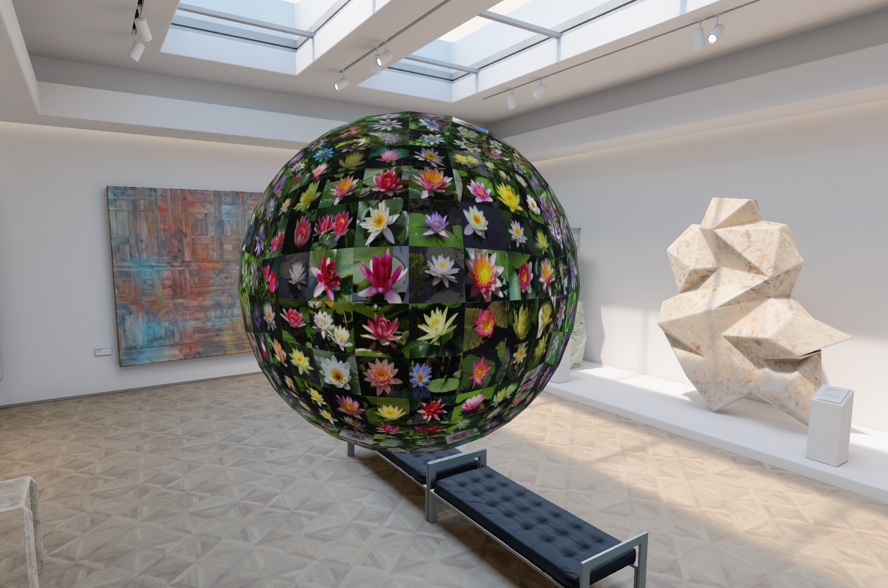

# Multimedia Sphere

An experimental visionOS app for browsing multimedia search results on an interactive 3D sphere, developed as part of my bachelor project at the University of Basel in 2024.The work informed the MediaMix system, described in our [MMM 2025 publication](https://doi.org/10.1007/978-981-96-2074-6_37).

Built with SwiftUI, RealityKit, and ARKit, the prototype explores how spatial layouts and gesture-based interaction can help users navigate image collections on Apple Vision Pro. 

The prototype displays images across a procedurally generated sphere. Users can move and rotate the sphere, select an image to open a larger view, and close that view to continue browsing.

## Demo




## Project context

My bachelor project, *Mixed-Reality Multimedia Interaction: Exploring User Interaction with Eye Tracking and Gesture Recognition in Mixed-Reality for Multimedia Retrieval*, investigated how to arrange and browse large collections of images in mixed reality. The work was intended to inform the interface design of the MediaMix multimedia retrieval system.

The broader project explored both quad-sphere and UV-sphere layouts, their texture-mapping tradeoffs, and interactions for moving, rotating, selecting, and zooming into image collections. 

### My contribution

- Implemented procedural sphere geometry and per-image mesh entities.
- Developed texture mapping for displaying an image collection across the sphere.
- Adapted gesture handling so interactions with individual image tiles move or rotate the complete sphere.
- Integrated image selection and an enlarged SwiftUI image view into the immersive scene.
- Compared spherical layouts and discussed their interaction and image-distortion tradeoffs in the project report.

## How it works

The geometry starts with a grid on each of the six faces of a cube. Normalizing the grid's vertices projects them onto a unit sphere. Each group of four adjacent vertices becomes a separate image tile with its own texture and collision shape.

At the current grid resolution of 9 vertices per edge, the sphere contains `6 × 8 × 8 = 384` tiles. Images are loaded from the asset catalog using names from `image_00001` to `image_00384`.

SwiftUI provides the app structure and enlarged-image interface. RealityKit renders the entities and handles targeted interactions, while the local `RealityKitContent` package supplies gesture components and extensions.

Image selection uses the system's targeted gesture handling and hover effects. The app does not implement its own eye tracker or collect raw gaze data.

## Getting started

### Requirements

- A Mac with Xcode and the visionOS SDK installed. The project was created with Xcode 16, and the local package declares Swift tools version 6.0.
- A visionOS 2.0 or later destination. Use Apple Vision Pro to validate device tracking and spatial interactions.

### Run

1. Clone or download this repository.
2. Open `multimediaSphere.xcodeproj` in Xcode.
3. Select the `multimediaSphere` scheme and your visionOS run destination.
4. For a device build, choose your development team under **Signing & Capabilities** and adjust the bundle identifier if needed.
5. Build and run the app.

The `Packages/RealityKitContent` folder is a local source dependency and must remain alongside the app project.

> NOTE: Setup instructions need to be verified, will do that if I get access to a VisionPro again... 

## Controls

- **Drag an image tile:** move the sphere.
- **Rotate using the rotation gesture:** turn the sphere to explore other images.
- **Look at an image and pinch to select it:** open its enlarged view.
- **Close button:** dismiss the enlarged view.

Scaling is disabled for the image tiles in the current implementation.

## Code structure

```text
multimediaSphere/
├── multimediaSphereApp.swift   # App entry point and immersive scene
├── SphereView.swift            # Scene setup, gestures, and image attachment
├── SingleImageView.swift       # Enlarged-image view
├── AppModel.swift              # Immersive-space state
├── Sphere/                    # Geometry generation and image entities
├── Textures/                  # Texture loading and named materials
└── Assets.xcassets/            # Bundled images and app assets
Packages/
└── RealityKitContent/         # Local gesture components and extensions
```

## Credits and licensing

Flower images are from the [Oxford VGG Flower Datasets](https://www.robots.ox.ac.uk/~vgg/data/flowers/), compiled by Maria-Elena Nilsback and Andrew Zisserman.

Gesture handling is adapted from Apple's [Transforming RealityKit entities with gestures](https://developer.apple.com/documentation/realitykit/transforming-realitykit-entities-with-gestures) sample. 
